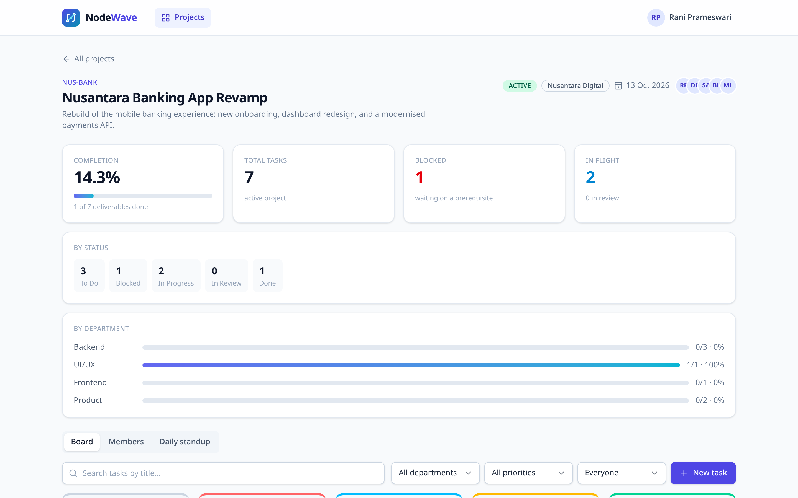

# NodeWave

Project & deliverable management for agency delivery teams, with the three
things that separate it from CRUD:

| | |
|---|---|
| **State-based permissions** | Who may do what depends on the actor's role *and* on attributes of the resource: project membership, department, tenant, and the task's current status. |
| **Inter-task dependencies** | A task cannot start until its prerequisites are `DONE`. Dependencies gate the state machine, auto-unblock when they clear, and refuse cycles. |
| **Concurrency safety** | Every mutable row carries a `version`. A stale write gets `409 VERSION_CONFLICT` with the current server state, never a silent overwrite. |
| **Immutable history** | `TaskLog` is append-only, enforced by a database trigger — not merely by the absence of an endpoint. |

The stack is Bun + Hono + Prisma 7 on the API, Next.js 16 (App Router) on the
web, PostgreSQL underneath.



---

## Layout

```
backend/     Bun + Hono + Prisma 7 API
docs/        Architecture, permissions, API reference, testing, deployment
PRD.md       The brief this was built against
```

The web app is a **separate repository** (`frontend/`) so the two can be reviewed
and deployed independently. Clone it alongside this one:

```bash
git clone <this-repo> nodewave-api
git clone <web-repo>  nodewave-web
```

## Quick start

Prerequisites: [Bun](https://bun.sh) ≥ 1.4, Docker (for PostgreSQL).

```bash
# 1. Database
cd backend
docker compose up -d          # postgres on :55432

# 2. Schema + demo data
bun install
bun run db:migrate            # prisma migrate deploy
bun run db:seed

# 3. API on :3000
./scripts/dev-server.sh start   # or: bun run dev

# 4. Web on :3001  (in a second terminal, in the frontend clone)
cd ../nodewave-web
bun install
cp .env.example .env.local      # NEXT_PUBLIC_BE_URL=http://localhost:3000
./scripts/dev-server.sh start   # or: bun run dev  (also pinned to :3001)
```

Open <http://localhost:3001>. The API owns port 3000; the web app talks to it
through `NEXT_PUBLIC_BE_URL` (`.env.example` in the web repository).

### Demo accounts

Password for every account: `Password123!`

| Email | Role | Notes |
|---|---|---|
| `pm@nodewave.dev` | Product Manager | Full read/write. Cannot mark a task `DONE` — that is the assignee's act. |
| `ux@nodewave.dev` | Internal Team (UI/UX) | |
| `fe@nodewave.dev` | Internal Team (Frontend) | |
| `be@nodewave.dev` | Internal Team (Backend) | |
| `qa@nodewave.dev` | Internal Team (Backend) | |
| `client@nusantaradigital.com` | Client Guest | Sees only their own org, only client-visible tasks. |
| `client@kopikita.id` | Client Guest | A different tenant, to demonstrate isolation. |
| `pm.kopi@nodewave.dev` | Product Manager | The other tenant's PM, for cross-tenant checks. |

Two seeded projects: **Nusantara Banking App Revamp** (`NUS-BANK`, org
*Nusantara Digital*) and **Kopi Kita POS System** (`KKI-POS`, org *Kopi Kita
Group*). The dependency chain is real: `Frontend slicing` is `BLOCKED` behind
`Payments & KYC API`.

## What to look at first

| | |
|---|---|
| The locked buttons | Open a `BLOCKED` task as the frontend dev — every status renders, the illegal ones are disabled with a reason. [Screenshot](docs/screenshots/09-task-dialog-restricted.png) |
| Data masking | Sign in as a client guest: no assignees, no departments, no internal comments — removed server-side. [Screenshot](docs/screenshots/11-board-guest.png) |
| The standup | Derived from the audit trail, so it reports what *changed* rather than restating the board. [Screenshot](docs/screenshots/06-standup.png) |
| The audit trail | Append-only, trigger-enforced. [Test](backend/src/modules/tasks/audit.integrity.test.ts) |

## Verifying it

```bash
cd backend
bun test              # 40 unit + integration tests
./scripts/smoke.sh    # 39 end-to-end API assertions against a running server
bun run typecheck && bun run lint
```

And in the web repository, with both servers running:

```bash
bun run typecheck && bun run lint && bun run build
node scripts/journeys.mjs /tmp/shots   # drives a real browser, see docs/testing.md
```

See [docs/testing.md](docs/testing.md) for what each layer covers.

## Documentation

- [Architecture](docs/architecture.md) — layering, data model, the decisions that shaped them
- [Permissions & workflow](docs/permissions.md) — the full RBAC + ABAC matrix and the state machine
- [API reference](docs/api.md) — every endpoint, with its error codes
- [Testing](docs/testing.md) — unit, integration, smoke and browser journeys
- [Deployment](docs/deployment.md) — Railway + Vercel, and the environment variables each needs
